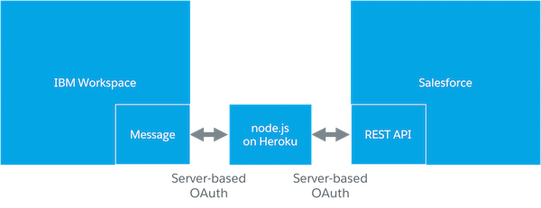

# salesforce-ibm-workspace-bot

This example application showcases how to build a simple bot that displays data from Salesforce within IBM Watson Workspace.

[IBM Watson Workspace](https://workspace.ibm.com/signin?l=true) is currently only available as a preview, so you can use it only by invitation. DM me on [Twitter](https://twitter.com/muenzpraeger) if you need one. ;-)

This image showcases the setup:

When a user enters a specific phrase/text in a Workspace space an external webhook, a node.js app on Heroku, will be called. The call contains the entered text which is then evaluated against pre-defined RegEx patterns. If a pattern matches an according REST call to a Salesforce org is executed. The returned data of that call then gets posted to the origin Workspace space.

# Prerequisites

For running the app on your own you'll need to fulfill the following requirements:

* Access to a Salesforce org, i. e. a Developer Edition (You can [signup here for free](https://developer.salesforce.com/signup) if you don't have one).
* A Connected App [set up](https://help.salesforce.com/apex/HTViewHelpDoc?id=connected_app_create.htm) in the Salesforce Org.
* An IBM Watson Workspace account

# Implementation

## Setup the Workspace App

1. Create a new app on the [Workspace App site](https://developer.watsonwork.ibm.com/apps).
2. Enter an app name of your choice, i. e. "Salesforce Bot".
3. Click on *Create* and copy the shown "App ID" and "App secret", you'll need it later.
4. Click on "Listen to Events" and add an outbound webhook.
5. Enter a name of your choice for the webhook, i. e. "BotInterface".
6. Enter the URL of your Heroku app in the field "Webhook URL" with the url junction /botInterface. For example: https://mybot.herokuapp.com/botInterface.
7. Select "message-created" as event type and click on *Save*.
8. Copy the displayed "Webhook secret", you'll also need this one later.
9. Close the dialog.

## Deploy the app to Heroku

The easiest way to test the application on your own is deploying it to [Heroku](https://www.heroku.com) via the Deploy button.

After the deployment you have to enter the configuration values for the app as following:

* *SALESFORCE_CONSUMER_KEY* - enter the Connected App consumer key
* *SALESFORCE_CONSUMER_SECRET* - enter the Connected App consumer secret
* *SALESFORCE_USERNAME* - enter the name of the Salesforce integration user
* *SALESFORCE_PASSWORD* - enter the password of the Salesforce integration user
* *WW_APP_ID* - enter the Workspace App ID
* *WW_APP_SECRET* - enter the Workspace secret
* *WW_WEBHOOK_SECRET* - enter the Workspace webhook secret

Wait till the node.js has started.

## Enable the Workspace App

Go back to the previously configured Workspace App and click on *Enable*. This will kickoff the serverside validation of the webhook.

Now you can add the newly created app to any of your Workspace spaces. Type 'help' to see the list of available commands.

## Considerations

Workspace posts any created message to the webhook. That means when the bot posts a message it gets back-posted from Workspace to the bot. It is important to check in the incoming requests who the sender of the message is to avoid infinite loops. ;-)

If you've chosen another name for your app than "Salesforce Bot" you've to change the name in line 19 of the file [botInterface](https://github.com/muenzpraeger/salesforce-ibm-workspace-bot/blob/master/node/botInterface.js).

# Kudos

Checkout the [Slack](https://github.com/ccoenraets/salesforce-bot-slack) and [Facebook Messenger](https://github.com/ccoenraets/salesforce-bot-messenger) repos of my colleague [Christophe Coenraets](http://coenraets.org/blog/) who did similar implementations (and with this some of the code pre-work).

# License

For licensing see the included [license file](https://github.com/muenzpraeger/salesforce-ibm-workspace-bot/blob/master/LICENSE.md).